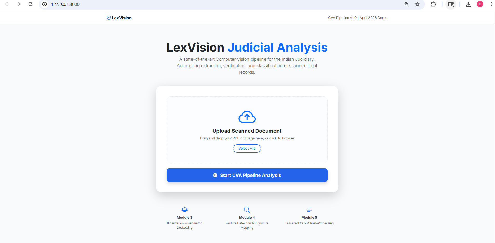
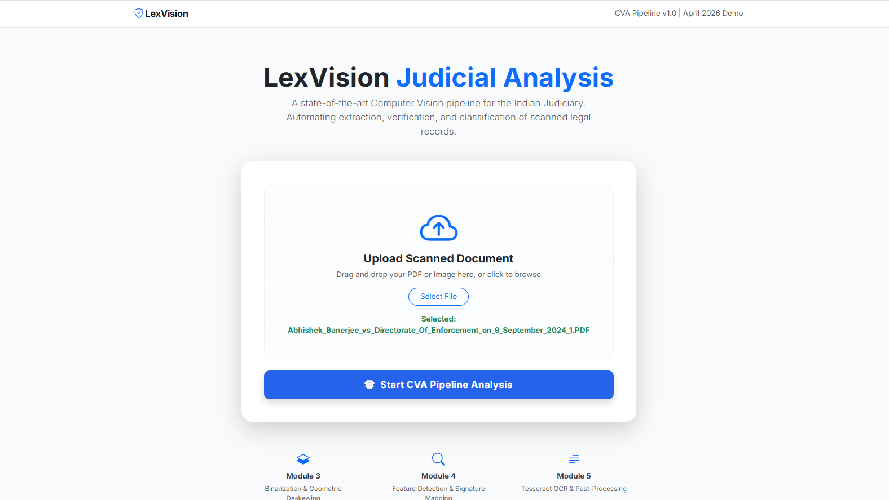
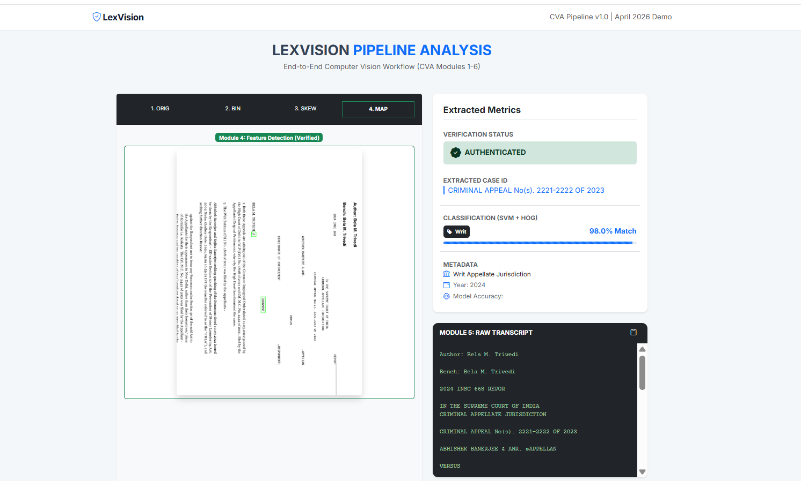
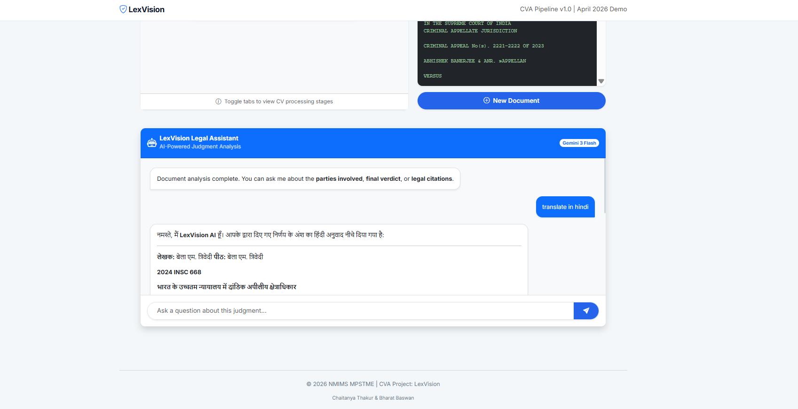

# Legal Document Summarization Pipeline for Indian Supreme Court Judgments

**NLP Research Project**  
**Author:** Chaitanya Thakur  
**Status:** Completed (April–June 2026)

---

## Overview

Developed a complete research-grade pipeline for **extractive and abstractive summarization** of long legal documents. Processed **1,999 Supreme Court of India judgments** (2020–2024) and conducted a rigorous comparative evaluation of four models: **TF-IDF, TextRank, BART, and T5**.

The pipeline includes PDF ingestion with OCR fallback, intelligent chunking for very long documents, multiple summarization approaches, and comprehensive evaluation using ROUGE, BERTScore, and Wilcoxon statistical significance tests.

This work highlights important differences between lexical overlap (ROUGE) and semantic similarity (BERTScore) in the **legal domain**.

---

## Key Features

- Robust 3-layer PDF text extraction (pdfplumber → PyMuPDF → Tesseract OCR + OpenCV preprocessing)
- Sliding window chunking with overlap for long judgments
- Extractive: TF-IDF + TextRank
- Abstractive: BART-large-cnn + T5-small
- Headnote-based reference summary extraction
- Full train/val/test split (70/15/15, year-stratified)
- Multi-metric evaluation + statistical significance testing
- Reproducible results with saved CSVs and visualizations

---

## Dataset Statistics

- **Total Documents:** 1,999
- **Avg. Length:** 9,873 words
- **Median Length:** 6,028 words
- **Year Distribution:** ~400 judgments per year (2020–2024)
- **Splits:** Train (1,399), Val (300), Test (300)

---

## Results Summary

| Model     | ROUGE-1 | ROUGE-2 | ROUGE-L | BERTScore-F1 | Avg Time (s) |
|-----------|---------|---------|---------|--------------|--------------|
| TF-IDF    | **0.4927** | **0.3937** | **0.3106** | **0.8272** | **0.01** |
| TextRank  | 0.4405  | 0.3478  | 0.2932  | 0.8227       | 0.02         |
| BART      | 0.2898  | 0.1941  | 0.2305  | 0.8231       | 28.56        |
| T5        | 0.2787  | 0.1919  | 0.2179  | 0.8020       | 11.89        |

**Key Insight:** TF-IDF performs best on ROUGE, while BART achieves near-parity on semantic quality (BERTScore) despite lower lexical overlap.

Wilcoxon tests show extractive methods are **statistically significantly better** than abstractive ones on ROUGE metrics (p < 0.001).

---

## Tech Stack

- **Core:** Python, Pandas, NumPy, scikit-learn, NetworkX
- **NLP:** Hugging Face Transformers (BART, T5), ROUGE, BERTScore
- **PDF/OCR:** pdfplumber, PyMuPDF, Tesseract, OpenCV
- **Visualization:** Matplotlib, Seaborn

---

## Project Structure (Planned)
legal-summarization/
├── pipeline.py                 # Main pipeline script
├── dataset/                    # Raw PDFs + splits
├── assets/                     # Results CSVs + figures
├── notebooks/                  # Analysis notebooks
├── README.md
└── requirements.txt
text---

## How to Run

```bash
pip install -r requirements.txt
python pipeline.py

## Project Demo Data Preprocessing
### End-to-End Pipeline




### Legal Assistant Chat

